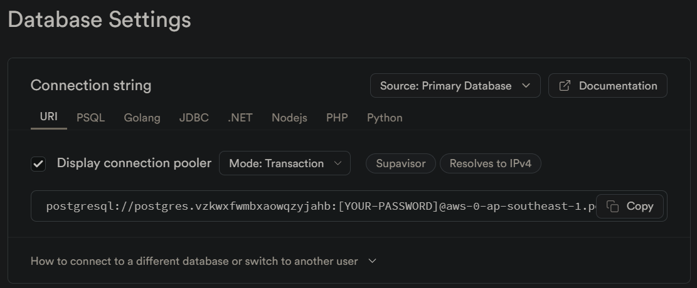
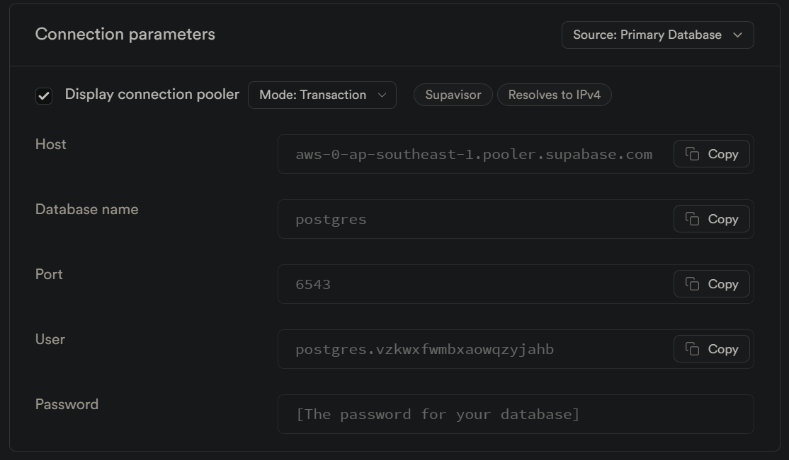
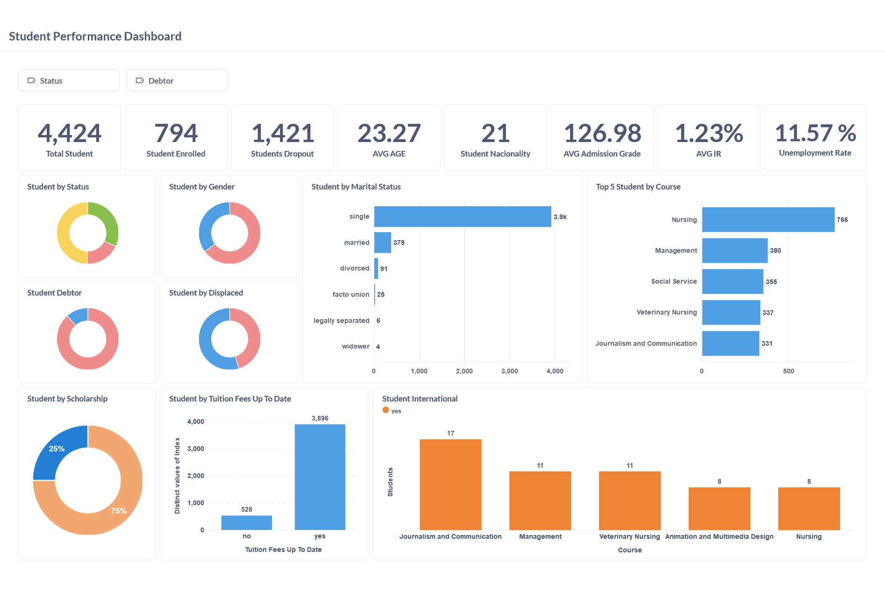

# Proyek Akhir: Menyelesaikan Permasalahan Perusahaan Edutech

## Business Understanding

Jaya Jaya Institut merupakan salah satu institusi pendidikan perguruan yang telah berdiri sejak tahun 2000. Hingga saat ini ia telah mencetak banyak lulusan dengan reputasi yang sangat baik. Akan tetapi, terdapat banyak juga siswa yang tidak menyelesaikan pendidikannya alias dropout. Jumlah dropout yang tinggi ini tentunya menjadi salah satu masalah yang besar untuk sebuah institusi pendidikan. Oleh karena itu, Jaya Jaya Institut ingin mendeteksi secepat mungkin siswa yang mungkin akan melakukan dropout sehingga dapat diberi bimbingan khusus.


### Permasalahan Bisnis

Di banyak institusi pendidikan, dropout _student_ menjadi masalah serius yang dapat mempengaruhi reputasi institusi dan keseimbangan keuangan jangka panjang. Sama halnya yang terjadi di Jaya Jaya Institut. Dengan memanfaatkan data yang ada saat pendaftaran _student_ dan performa akademis mereka pada akhir semester pertama dan kedua, kita dapat membangun model klasifikasi untuk memprediksi kemungkinan seorang _student_ untuk melakukan dropout. Urgensinya adalah untuk mengidentifikasi faktor-faktor yang dapat mempengaruhi keputusan dropout tersebut, seperti jalur akademis, faktor demografis, dan sosial-ekonomi.

Efek jangka panjang dari masalah ini termasuk penurunan angka kelulusan, peningkatan biaya akibat kehilangan pendapatan _student_, dan dampak negatif terhadap citra institusi. Dengan mengantisipasi dropout melalui model prediksi yang tepat, institusi dapat mengambil langkah-langkah intervensi yang diperlukan untuk meningkatkan retensi _student_ dan menciptakan lingkungan akademik yang lebih sukses.


### Cakupan Proyek
1. Pengumpulan dan Pemahaman Data:
    - Pada proyek ini dataset sudah tersedia, terlampir pada folder dataset (`data.csv`) atau link dataset pada sub dibawah.
    - Memahami struktur dan karakteristik data, termasuk jenis variabel, jumlah data, dan nilai-nilai yang hilang atau tidak valid.

2. Eksplorasi Data Analysis (EDA):
    - Melakukan eksplorasi data awal untuk mengidentifikasi pola, tren, dan hubungan antar variabel.
    - Visualisasi data untuk memahami distribusi variabel dan mendeteksi anomali atau outlier.

3. Pembersihan dan Persiapan Data:
    - Menangani nilai-nilai yang hilang, duplikat, atau tidak valid dalam dataset.
    - Mengonversi variabel-variabel yang diperlukan menjadi format yang sesuai untuk analisis lebih lanjut.
    - Normalisasi atau standarisasi variabel numerik.

4. Analisis Faktor-Faktor yang Mempengaruhi Dropout:
    - Melakukan analisis statistik untuk mengidentifikasi variabel-variabel yang signifikan mempengaruhi dropout.
    - Menggunakan teknik korelasi untuk menemukan hubungan antar variabel.

5. Pengembangan Model untuk memprediksi Student Dropout:
    - Membagi dataset menjadi data latih dan data uji untuk pengembangan model prediksi.
    - Menggunakan resampling `SMOTE`, `Random Under Sampling` dan `Tanpa Resampling`
    - Menerapkan PCA agar didapatkan komponen yang optimal
    - Membangun dan melatih model prediksi menggunakan algoritma machine learning. Model machine learning yang digunakan pada proyek ini:
        - Random Forest
        - Logistic Regression
        - Decision Tree
        - XGB
        - Gradien Boosting
        - SVM
    - Mengevaluasi performa model

6. Merancang dan membangun dashboard interaktif menggunakan `Metabase` yang terintegrasi dengan `Supabase`.

Dengan cakupan proyek yang sudah dijelaskan di atas, diharapkan dapat memberikan hasil yang komprehensif dan _actionable_ bagi Jaya Jaya Institut dalam mengurangi tingkat dropout dan meningkatkan lingkungan akademik yang lebih sukses.

### Persiapan

Sumber data: 
- <a href="https://github.com/dicodingacademy/dicoding_dataset/blob/main/students_performance/">Dataset Jaya Jaya Institut</a> 
- <a href="https://archive.ics.uci.edu/dataset/697/predict+students+dropout+and+academic+success">Predict Students' Dropout and Academic Success</a> 


### Setup environment:

- Pastikan terhubung ke internet untuk dapat melakukan install module (library) 
- Buka cmd atau powershell as administrator

```bash
pip install -r requirements.txt
```

### Melakukan Upload Dataset ke Supabase

- Pastikan kamu sudah membuat akun <a href="https://supabase.com/dashboard/sign-in?">Supabase</a>.
- Jika sudah, klik `New Project`
- Kamu dapat mengisi form sesuai dengan keinginanmu, namun pastikan bahwa password mudah diingat atau perlu kamu salin di notepad.
- jika sudah kamu hanya perlu klik `Create New Project`. Tunggu sampai proses build selesai.
- Setelah itu klik Project Setting -> Database
- Lakukan copy Cennection String URL berikut.

    <!--  -->
    

- Paste pada notebook bagian `Mengupload dataset ke supabase`, ganti [Your Password] dengan password yang kamu masukkan tadi.
- Lakukan run notebook dari awal hingga bagian  `Mengupload dataset ke supabase`. Pastikan dapat berjalan dengan baik.

### Menghubungkan Database Supabase ke Metabase dengan Docker

- Pastikan kamu memiliki aplikasi <a href="https://www.docker.com/products/docker-desktop/" target="_blank">Docker</a> yang sudah terinstall atau kamu dapat melakukan install terlebih dahulu.
- Jika sudah terinstall. Run command berikut:
``` bash
docker run -p 3000:3000 --name metabase metabase/metabase
```
- Halaman browser baru akan terbuka. Kemudian Klik Settings -> Admin settings -> Database -> Add database
- Masukkan informasi konfigurasi dari database yang sebelumnya telah kamu buat.

    <!--  -->
    
- Jika sudah lengkap, klik `Save`.
- Kamu dapat membuat model, visualisasi dan dashboard sesuai keinginanmu.


## Run Steamlit Prediction Apps


Untuk menjalankan aplikasi ini, kamu harus masuk ke folder (_directory_) yang sesuai dengan file `prediction.py` berada, kemudian masukkan command berikut dan tekan Enter:
```bash
streamlit run prediction.py
```
 Atau akses secara online: <a href="https://students-performance.streamlit.app/">Students Performance App</a> 


### Fitur:

1. Melakukan prediksi dengan mengupload data student dalam format `.csv`, sudah ada juga contoh file yang bisa kamu coba di `dataset/sample_test.csv`. Terdapat slider untuk mengatur banyaknya data yang ingin dipratinjau.
2. Pemilihan model machine learning yang memungkinkan _user_ dapat beriteraksi dengan aplikasi menjadi lebih baik.
3. Hasil prediksi dapat didownload dalam format `.csv` sehingga menjadi lebih mudah diakses.


## Business Dashboard




Dashboard ini mencakup berbagai metrik dan visualisasi, termasuk score card total _student_ dropout, graduate, dan enrolled. Selain itu, menampilkan rata-rata umur, jumlah kewarganegaraan yang menjadi _student_ di institusi, nilai rata-rata admission grade, inflation rate, dan unemployment rate.

Tidak hanya itu, melalui dashboard ini, pengguna dapat melihat _student_ berdasarkan gender, marital status, debtor, displaced, beasiswa, dan melihat siswa yang membayar tepat waktu atau tidak. Juga menampilkan top course yang paling banyak diambil oleh student baik secara nationality maupun international.

Terdapat filter yang memungkinkan pengguna untuk menflter data berdasarkan status dan debtor. Dengan memahami faktor-faktor yang mempengaruhi dropout, Jaya Jaya Institut dapat mengambil langkah-langkah proaktif untuk memberikan pendampingan khusus kepada student yang berisiko dropout, dengan tujuan mengurangi tingkat dropout dan meningkatkan tingkat kelulusan.


## Conclusion

- _Student_ yang tidak mendapatkan beasiswa cenderung memiliki tingkat dropout yang lebih tinggi dibandingkan dengan mereka yang menerima beasiswa. Hal ini menunjukkan pentingnya dukungan finansial dalam memotivasi _student_ untuk menyelesaikan pendidikan mereka.

- _Student_ yang teratur dalam pembayaran biaya kuliah memiliki kecenderungan yang lebih tinggi untuk lulus, sementara yang tertinggal dalam pembayaran lebih rentan untuk dropout. Manajemen keuangan yang baik sepertinya berkorelasi dengan keberhasilan akademik.

- Status pernikahan mempengaruhi hasil akademik. _Student_ yang masih single cenderung memiliki tingkat kelulusan yang lebih tinggi dibandingkan dengan mereka yang sudah menikah, mungkin karena tanggung jawab tambahan yang dialami _student_ yang sudah menikah.

- Status perpindahan tidak sepenuhnya menentukan hasil akademik, tetapi _student_ yang tidak mengalami perpindahan cenderung memiliki tingkat retensi yang sedikit lebih tinggi daripada mereka yang mengalami perpindahan.

- _Student_ yang mendaftar di usia lebih tua, khususnya di atas 23 tahun, cenderung memiliki tingkat dropout yang lebih tinggi. Ini mungkin terkait dengan tantangan menyesuaikan diri dengan lingkungan akademik setelah gap year dari pendidikan formal.

- _Student_ dengan utang atau kinerja akademik yang buruk lebih rentan untuk dropout. Hutang dapat menjadi beban tambahan yang menghambat kemajuan akademik.

- Model machine learning Logistic Regression yang dikembangkan memiliki akurasi 90% dan SVM dengan akurasi 92%. Namun Logistic Regression lebih stabil dibandingkan SVM dari uji coba yang sudah dilakukan. Sehingga pada kasus ini menggunakan Logistic Regression sebagai model utama untuk melakukan prediksi status student **Dropout** ataupun **Graduate**. Model dapat melakukan prediksi dan sudah dideploy menggunakan Streamlit.

### Rekomendasi Action Items

- Jaya Jaya Institut perlu mempertimbangkan peningkatan dalam penawaran beasiswa dan bantuan keuangan lainnya untuk mengurangi beban finansial _student_ yang tidak mampu. Prioritaskan kepada _student_ yang memiliki performance yang baik terlebih dahulu.

- Implementasi sistem pengingat pembayaran atau program bantuan keuangan untuk _student_ yang mengalami kesulitan dalam memenuhi kewajiban biaya kuliah mereka. Tambahkan opsi cicilan juga jika diperlukan.

- Menyediakan dukungan khusus untuk _student_ yang sudah menikah atau bekerja, seperti pembelajaran yang mungkin bisa dilakukan secara online. Sehingga student lebih fleksibel dalam mengikuti pembelajaran.

- Memahami faktor-faktor yang mendasari perpindahan _student_ dan mengembangkan program orientasi dan integrasi yang lebih baik bagi _student_ baru.

- Menyediakan program transisi dan dukungan akademik tambahan untuk _student_ yang kembali ke sekolah setelah mengalami gap year.

- Mengembangkan program manajemen utang dan bimbingan akademik yang terintegrasi untuk membantu _student_ dalam mengatasi kesulitan finansial dan meningkatkan kinerja (_performance_) mereka.

